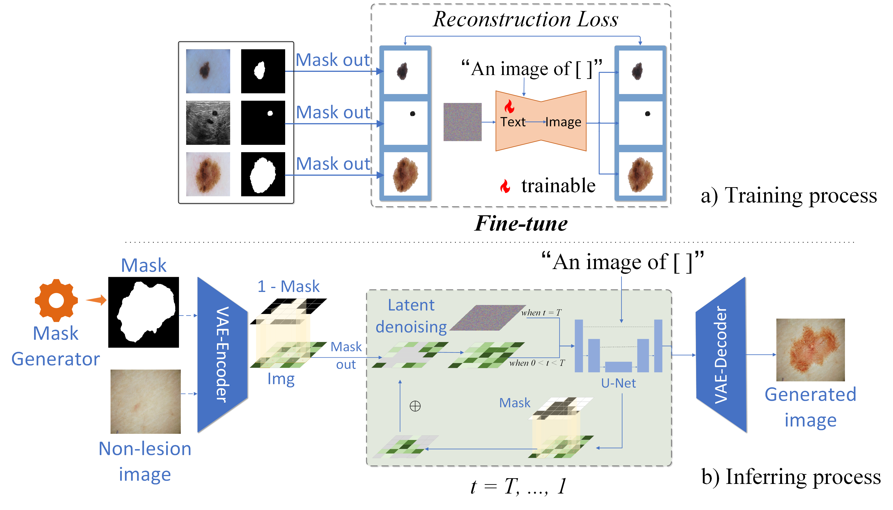

# MedDiff-FT（MICCAI-2025) 
[MedDiff-FT: Data-Efficient Diffusion Model Fine-tuning with Structural Guidance for Controllable Medical Image Synthesis](https://arxiv.org/abs/2507.00377#:~:text=To%20address%20these%20challenges%2C%20we%20present%20MedDiff-FT%2C%20a,dependency%20and%20domain%20specificity%20in%20a%20data-efficient%20manner)

## Introduction
The paper propose a lightweight, data-efficient method for controllable medical image-mask pair generation. Our method fine-tunes Stable Diffusion with limited data (under 30 minutes and 24GB memory) and uses automated quality assessment protocol filters to enhance reliability and diversity. In the inference phase, we use guide mask for controllable generation to achieve controllable shape and location of the lesion area. We also use a lightweight diffusion model as a mask generator to improve the versatility of the generated images. Experiments on five segmentation tasks demonstrate that models trained with our synthetic data achieve an average 3% accuracy improvement.

<div align="center">
  
<div align="left">

## Environment Configuration Commands

```bash
# Create a new conda environment named 'MedDiff-FT' with Python 3.10.14
conda create -n MedDiff-FT python=3.10.14

# Activate the newly created environment
conda activate MedDiff-FT

# Change directory to the project folder
cd MedDiff-FT

# Install all required Python packages listed in requirements.txt
pip install -r requirements.txt
```

## Base Model Access Information
- **HuggingFace Hub Path**: [stable-diffusion-v1-5/stable-diffusion-inpainting](https://huggingface.co/stable-diffusion-v1-5/stable-diffusion-inpainting)

## Dataset
- [ISIC-2017](https://challenge.isic-archive.com/data/#2017)
- [ISIC-2018](https://challenge.isic-archive.com/data/#2018)
- [BUSI](https://scholar.cu.edu.eg/?q=afahmy/pages/dataset)
- [PH](https://www.fc.up.pt/addi/ph2%20database.html)
- [DDTI](https://www.spiedigitallibrary.org/conference-proceedings-of-spie/9287/92870W/An-open-access-thyroid-ultrasound-image-database/10.1117/12.2073532.short?SSO=1)

## Train
```bash
cd MedDiff-FT/main

accelerate launch train.py   --pretrained_model_name_or_path='/path/checkpoint' \
--instance_data_dir='../data' \
--output_dir='../check/test' \
--resolution=512 \
--train_batch_size=1 \
--gradient_accumulation_steps=2 \
--learning_rate=3e-6 \
--max_train_steps=500 \
```
## Infer
```bash
cd MedDiff-FT/main

python infer.py \
--model_path /path/to/model \
--input_path /path/to/input_images \ # normal images
--label_path /path/to/masks \ # genreate masks
--out_path /path/to/output \
```
# TODO List

- [x] Initialize project repository
- [x] Release training and inference code
- [ ] Release the code about Mask Generator
- [ ] Release the code about Non-lesion Image Generator
- [ ] Release the checkpoints


## Citation
If you find this work is helpful to your research, please consider citing our paper:
```bibtex
@misc{xie2025meddiffft,
  title={MedDiff-FT: Data-Efficient Diffusion Model Fine-tuning with Structural Guidance for Controllable Medical Image Synthesis},
  author={Xie Jianhao and Zhang Ziang and Weng Zhenyu and Zhu Yuesheng and Luo Guibo},
  year={2025},
  eprint={2507.00377},
  archivePrefix={arXiv},
  primaryClass={cs.CV},
  url={https://arxiv.org/abs/2507.00377}
}
```
